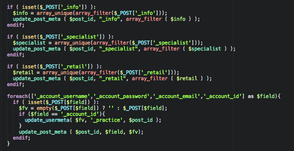

# semanticolor

Provide semantic coloring for Atom. Define what is colorized. Every variable, function, class name, constant has a consistent color across all of your source.

* Be as diverse as you want. Define how diverse your color scheme is with 8-180 colors used.
* LESS Styles compiled from your base syntax colors for good consistent contrast against BG!
* Customize the entities that is colorized

For JavaScript syntax to work properly you will need the language-javascript-semantic package since Atom does not properly parse JavaScript on it's own.

Some features and ideas were taken from that package and applied globally, not just to JavaScript.

